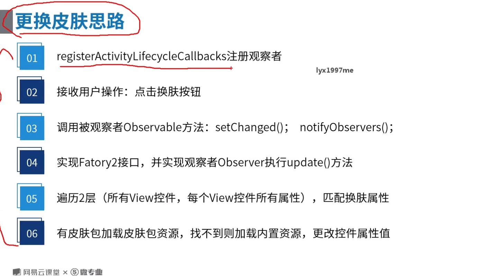
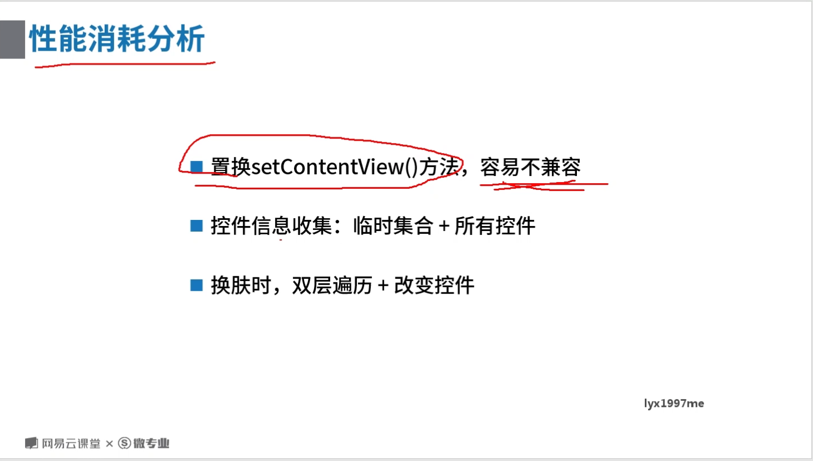

## 内置换肤

 **activity实现了factory2
**
 android:configChanges="uiMode"> <!-- 需要配置此属性=uiMode，才能更换navigation  -->
## 加载皮肤包

- 10.0 权限 :requestLegacyExternalStorage使用传统方法申请 
- 10.0 非sdk接口限制:不能反射去修改mFactorySet的值为false重写一个LayoutInter去设置factory2

 

