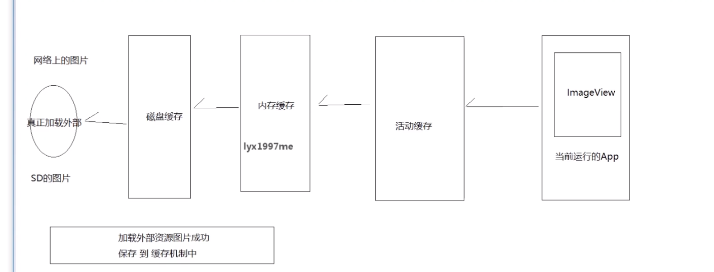

# Cache

- 2.Glide活动缓存
  - 2.1回收机制：GC扫描的时候回收,重写弱引用，ReferenceQueue监听移除容器（GC被动移除）（弱引用）
  
  - 2.2容器管理方式：资源的封装 Key  ----- （弱引用<Value>)
  
  - 2.3手动移除的区分
  
  - 2.4关闭线程
  
  - 2.5Value监听加入
  
-  3.内存缓存-LRU算法：最近没有使用的元素，会自动被移除掉。
     - LruCache内部利用LinkedHashMap<K, V>，
     - LinkedHashMap: true==拥有访问排序的功能 (最少使用元素算法-LRU算法)
     - put：
         - 1.移除掉一个key重复的元素
    key=15151511551
    previous = key=15151511551
    entryRemoved
         - 2.trimToSize 移除哪些最近没有使用的元素 ---》 entryRemoved

-  4.Glide手写实现之磁盘缓存
保存时长比较长：保存在本地磁盘 文件的形式存储 （不再是保存在运行内存中，而是磁盘中）
LRU算法: ---> 最近没有使用的元素，会自动被移除掉
LruCahce -- Android中提供了
DiskLruCache --- Android中没有提供了 JakeWharton自己写了DiskLruCache
DiskLruCache：回收方式：LRU算法， 访问排序
DiskLruCache: 面向磁盘文件保存
sp == Editor edit

-   职责：
     - 活动缓存：给正在使用的资源存储的，弱引用
     - 内存缓存：为第二次缓存服务，LRU算法
     
总结：
第一次的时候，去网络下载图片，保存到磁盘缓存中（/sd/disk_lru_cache_dir/key）
第二次的时候，直接再活动缓存中，找到了资源
第三次的时候，直接再活动缓存中，找到了资源
第N次的时候，直接再活动缓存中，找到了资源

把Activity给返回回去的时候，进行释放，活动缓存的释放
又一次加载的时候，从内存缓存中获取了
下一次加载的时候，就是从活动缓存获取了

把App给杀掉
整个活动缓存，整个内存缓存，都没有了
所以从磁盘缓存中获取